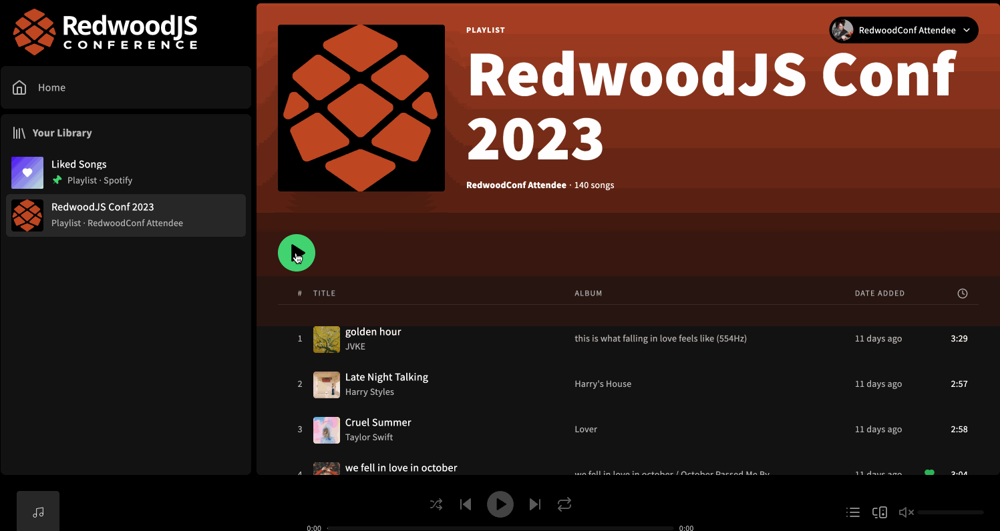

# Exercise 3: State management with the cache via `useFragment`

In this exercise, we will be using GraphQL fragments in a slightly different way. Apollo Client 3.8 added support for a new hook called `useFragment` that we will use as a way to query our cache and bind to cache updates to keep our UI in sync. We will begin to explore how Apollo Client's cache can be used as a state management tool without the need for extra Redwood cells to query to our server for the state.

## Setup

1. Install dependencies
   ```
   yarn
   ```
2. Start the app
   ```
   yarn rw dev
   ```

You should now be running the app in the same state as you saw in [exercise 2](https://github.com/jerelmiller/redwoodjs-conf-2023-workshop/tree/main/02-reusable-components-with-fragments) with the updates to the album tile and track details in place.

## Challenge

In this exercise, we are going to make our app a bit more robust by ensuring various aspects of our UI display the currently playing track.

We've noticed that when we begin to play a track, we have several problems in our UI that make it difficult to understand the context in which our app is playing. Let's click the big green play button on the "RedwoodJS Conf 2023" playlist. The playbar seems to be working correctly, but we want several additional things to happen:

- The big green button should become a pause button since we are playing tracks within this playlist
- The currently playing track name should be highlighted in a green color on the track list to make it easily visible within the playlist
- The track number should display a speaker icon when in a play state, otherwise show the track number when paused.
- The playlist name in the sidebar should be highlighted in a green color to denote that the track is currently playing in this context
- The playlist in the sidebar should display a speaker icon when in a play state, otherwise hide it when paused.

It should be noted that we want to avoid additional network requests for this data since we already have it in the cache, which means that we do not want convert these components to Redwood cells.

By the end of this exercise, our UI should look and behave like the following:



## Exercise

We will be using GraphQL fragments as a means to query the cache in this exercise. While fragments are typically part of GraphQL queries, Apollo uses them in various ways.

We will be using a new hook in Apollo Client 3.8 called [`useFragment`](https://www.apollographql.com/docs/react/data/fragments/#usefragment) that will allow us to query our cache for the data and react to updates for that data. In this way, fragments can be thought of as a sort of data selector on a type. Apollo will uses the selection set in the fragment to traverse the cache and retrieve the data. This means that fragments passed to `useFragment` can be arbitrary and do not have to represent an actual fragment in an existing query.

> NOTE: For this exercise, we will not be making any of these fragments part of existing queries. In your own apps you may decide to include these fragments as a part of queries to ensure the data will exist in the cache.

To keep things simple, each component in this exercise declares static variables at the top of the component that represent the dynamic data we want to query in our cache. This way you do not need to find the UI elements that make up the styles in our play/pause states. Our job is to update these variables from a static value to the value in the cache.

As an example, our `PagePlayButton` looks like this:

```ts
const PagePlayButton = ({ disabled, contextUri }: PagePlayButtonProps) => {
  // ...
  const isPlaying = false
  const isCurrentContext = false
  const isPlayingInContext = isPlaying && isCurrentContext
}
```

Here `isPlaying` and `isCurrentContext` are set to the static value `false`. We want to these values to be dynamic and bind to the values in the cache so that as the user plays/pauses playback, our UI updates accordingly. You do not need to update more than these variables in each component for the UI to function correctly.

This exercise will also require us to learn more about [type policies](https://www.apollographql.com/docs/react/caching/cache-configuration#typepolicy-fields) and [customizing cache IDs](https://www.apollographql.com/docs/react/caching/cache-configuration#customizing-cache-ids) which allows us to specify how data in the cache should be represented. Apollo uses a [normalized cache](https://www.apollographql.com/docs/react/caching/overview#data-normalization) which is an important to best understand how data is stored in the cache.
